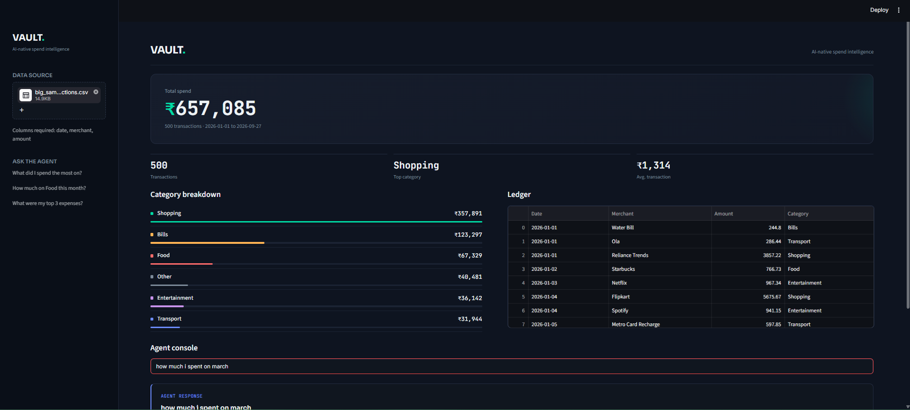

# AI-Powered Expense Tracking Agent

An intelligent personal finance assistant that automates transaction categorization and enables natural-language financial queries using a Text-to-SQL agent powered by Google Gemini and SQLite.

---
<h2>Output Preview</h2>

<p align="center">
  
</p>

## Overview

Traditional expense tracking tools rely on static keyword matching or manual labeling. This project implements an agentic workflow that:
1. Ingests raw transaction records (CSV).
2. Deduplicates and categorizes merchants in batched requests using Gemini (`gemini-3.5-flash-lite`).
3. Persists records into a structured local SQLite database (`expenses.db`).
4. Translates arbitrary plain-English questions into valid, read-only SQL queries, executes them, and returns conversational summaries alongside execution traces.

---

## Key Features

- **Batch LLM Categorization:** Identifies and classifies unique merchants in a single batched API call to minimize latency and token consumption.
- **Natural Language Text-to-SQL:** Converts conversational financial inquiries (e.g., *"How much did I spend on Food last week?"*) into optimized SQLite queries.
- **Execution Guardrails:** Restricts database interactions to `SELECT` operations to prevent data tampering or injection vulnerabilities.
- **Transparent Agent Trace:** Displays the underlying SQL query and raw database output in the UI for complete audibility and debugging.
- **Interactive Analytics:** Generates real-time category spending breakdowns and visual bar charts using Streamlit.

---

## System Architecture

```text
[ User CSV Upload ]
        │
        ▼
[ Data Parsing & Normalization ]
        │
        ▼
[ LLM Batch Categorization ] ──(Gemini API)──► [ Category Assignment ]
        │
        ▼
[ SQLite Database (expenses.db) ]
        │
        ├───────────────────────────────┐
        ▼                               ▼
[ Streamlit Visual Dashboard ]   [ Text-to-SQL Agent Pipeline ]
                                        │
                                        ▼
                                1. Natural Language Query
                                2. Gemini SQL Generation
                                3. Read-Only Safety Validation
                                4. SQLite Execution
                                5. Gemini Plain-English Synthesis
                                        │
                                        ▼
                                [ Answer & Trace in UI ]
